# Experiments Overview

This directory contains one folder per experiment stage and the shared execution entrypoints used across all stages. Runnable stages share the same simulator source trees and differ by `sb.cfg`.

## Experiment Folder Structure

Most runnable stages follow this layout:

```text
experiments/<stage-id>/
├── sb.cfg
├── README.md
├── processed/
│   └── bandwidth_latency.csv
└── figures/
    ├── bandwidth_latency_ramulator.pdf
    ├── bandwidth_latency_zsim_mem.pdf
    ├── bandwidth_latency_zsim_core.pdf
    └── pngs/
```

`00-damov-native` is a native reference stage and does not follow the full generic runner layout.

The committed outputs follow the three-view terminology used in the paper:

- `bandwidth_latency_ramulator.*`: memory simulator view
- `bandwidth_latency_zsim_mem.*`: memory interface view
- `bandwidth_latency_zsim_core.*`: application view

Published raw results for stages 01 and 05 through 10 are hosted on Zenodo.
Archives for the reordered stages 02 through 04 are pending. Experiment 00
keeps its raw data in Git, and Experiment 11 generates its 50 simulation points
locally.

## Raw Results

| Stage | Raw-data location | MD5SUM |
| :--- | :--- | :--- |
| `00-damov-native` | [`00-damov-native/test-raw/`](00-damov-native/test-raw/) | `N/A` |
| `01-baseline` | [Download](https://zenodo.org/records/21760832/files/01-baseline.zip?download=1) | `38f1cf9f9a1f6f3c2adaec688fabcf4d` |
| `02-clock-scaling`          | [Download](https://zenodo.org/records/22261221/files/02-clock-scaling.zip?download=1)                                              | `28c05fc89e76a8a433b8f5acba0cc38b`                             |
| `03-correct-freq`           | [Download](https://zenodo.org/records/22261221/files/03-correct-freq.zip?download=1)                                            | `f4a626c44abb50136d2c0acb73540942 `                             |
| `04-memory-model`           | [Download](https://zenodo.org/records/22261221/files/04-memory-model.zip?download=1)                                             | `c29c8f59c595386cd86740750c4d5cb3 `    
| `05-address-mapping` | [Download](https://zenodo.org/records/21760832/files/05-address-mapping.zip?download=1) | `74bb3d8d63cf43ddd06929b9dc27a7f9` |
| `06-noc` | [Download](https://zenodo.org/records/21760832/files/06-noc.zip?download=1) | `5a6fdeb0af978f8eaf4f355e46453a54` |
| `07-prefetcher` | [Download](https://zenodo.org/records/21760832/files/07-prefetcher.zip?download=1) | `1e4fd36b3c25af7603f2e817c2448980` |
| `08-portability-ramulator2` | [Download](https://zenodo.org/records/21760832/files/08-ramulator2.zip?download=1) | `60cb5aac4b34df03c297bdfa7ef85cec` |
| `09-portability-dramsim3` | [Download](https://zenodo.org/records/21760832/files/09-dramsim3.zip?download=1) | `87406cce9943ea51eb6a98ebc8a350f1` |
| `10-portability-dramsys` | [Download](https://zenodo.org/records/21760832/files/10-dramsys.zip?download=1) | `cc52eb538c221228e72004a9581f4388` |
| `11-mem-intensive` | Generated by `./experiments/runner.sh 11-mem-intensive` | `N/A` |

## Shared Entrypoints

The following files live directly under `experiments/` and are shared across all stages:

| File | Purpose |
| :--- | :--- |
| `runner.sh` | Main local execution entrypoint. It runs a normal staged sweep or dispatches experiment 11 to its five-benchmark, multi-stage runner. Invoke as `./experiments/runner.sh <experiment-id>` from the repository root. |
| `run-one.sh` | Minimal per-run launcher copied into each generated `measurment_*/` directory by `runner.sh`. It is the single-run command body for local execution and can also be wrapped by a generic batch scheduler if desired. |
| `plot.py` | Post-processing script. Reads raw outputs, writes `processed/bandwidth_latency.csv`, generates `figures/`, and also writes PNG previews under `figures/pngs/`. If the memory simulator view is unavailable, it skips that plot instead of failing. By default it writes into `test-output/<stage-or-config-name>/`, not into the committed experiment folder. |

## Running the Experiments

### `runner.sh`

Runs the full bandwidth-latency sweep for one stage. Each measurement point is materialized as a `measurment_<rd>_<pause>/` directory inside `<stage>/test-raw/`.

```bash
# From the repository root (environment must be sourced first)
source .zsim-env
./experiments/runner.sh 01-baseline
```

After the run, the layout is:

```text
experiments/01-baseline/test-raw/
├── measurment_0_10000/
│   ├── sb.cfg
│   ├── zsim.out
│   └── ...
├── measurment_10_10000/
└── ...
```

`test-raw/` is gitignored; it never overwrites the committed paper results.

Before generating new run directories, `runner.sh` removes any existing `test-raw/measurment_*` directories for the selected stage.

`00-damov-native` uses a dedicated runner behind the same repository-level
entrypoint. Build it with `./setup.sh --build-damov`, then run and plot it:

```bash
./experiments/runner.sh 00-damov-native
./experiments/plot.py experiments/00-damov-native/test-raw \
  --config-dir experiments/00-damov-native
```

The three generated views correspond to the original-DAMOV evaluation in
Appendix A, Figure 13.

`setup.sh` builds isolated Ramulator and Ramulator2 ZSim variants. The reference table in `runner.sh` selects the appropriate binary automatically: `08-portability-ramulator2` uses the Ramulator2 variant, while the other staged experiments use the default Ramulator variant.

Experiment 11 is available through the same entrypoint. It runs all of its
correction and portability stages sequentially. No raw-results download is
needed because the dataset contains only five benchmark points per stage across
ten unique stages, for 50 simulation points in total. Figure 10 uses seven
correction stages; Figure 11e reuses the final Ramulator stage and adds the
three portability stages.

```bash
./experiments/runner.sh 11-mem-intensive
./experiments/11-mem-intensive/plot.py
```

### `run-one.sh`

Minimal single-point launcher. `runner.sh` invokes it automatically, but you can also call it manually for a prepared run directory:

```bash
cd ./experiments/01-baseline/test-raw/measurment_50_1000
bash run-one.sh
```

### `plot.py`

Post-processes a directory of `measurment_*` subdirs into a CSV and figures. Pass the `test-raw/` directory as the positional argument:

```bash
./experiments/plot.py experiments/01-baseline/test-raw \
  --config-dir experiments/01-baseline
```

Outputs by default to:

```text
test-output/01-baseline/
├── processed/bandwidth_latency.csv
└── figures/
    ├── bandwidth_latency_zsim_core.pdf
    ├── bandwidth_latency_zsim_mem.pdf
    ├── bandwidth_latency_ramulator.pdf   # only if memory-simulator stats present
    └── pngs/
```

The committed paper figures in `experiments/<stage>/figures/` are **not** touched. To regenerate them in-place:

```bash
./experiments/plot.py experiments/01-baseline/test-raw \
  --config-dir experiments/01-baseline \
  --output-dir experiments/01-baseline
```

### Comparing stages

Use `compare-results.sh` to quantify the delta between two stages from their committed (or freshly generated) `processed/bandwidth_latency.csv`:

```bash
./scripts/compare-results.sh 01-baseline 04-memory-model
```

You can also point it at a freshly generated CSV:

```bash
./scripts/compare-results.sh \
  test-output/01-baseline/processed/bandwidth_latency.csv \
  test-output/04-memory-model/processed/bandwidth_latency.csv
```

## Experiment Gallery

This section is stage-oriented, not paper-subfigure-oriented. Each populated stage shows every committed view that exists for that experiment. The paper may use only a subset of these views in a given figure.

### `01-baseline`

Paper figure: Figure 2  
| Memory simulator view | Memory interface view | Application view |
|:---:|:---:|:---:|
|  |  |  |

### `02-clock-scaling`

Paper figure: Figure 3

| Memory simulator view | Memory interface view | Application view |
|:---:|:---:|:---:|
| 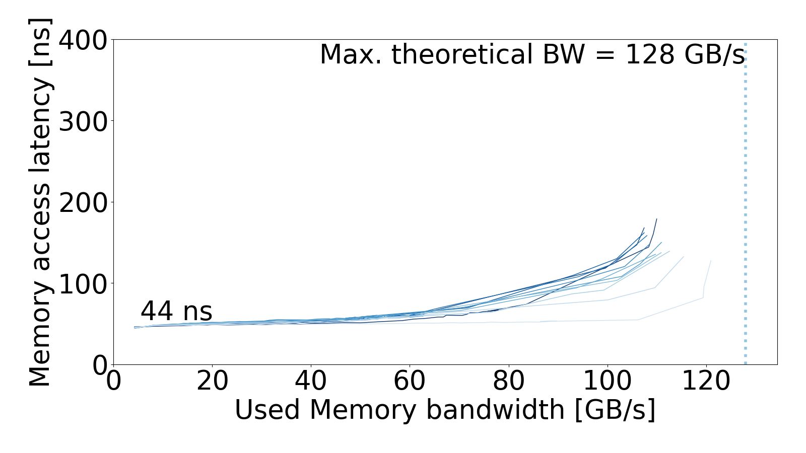 | 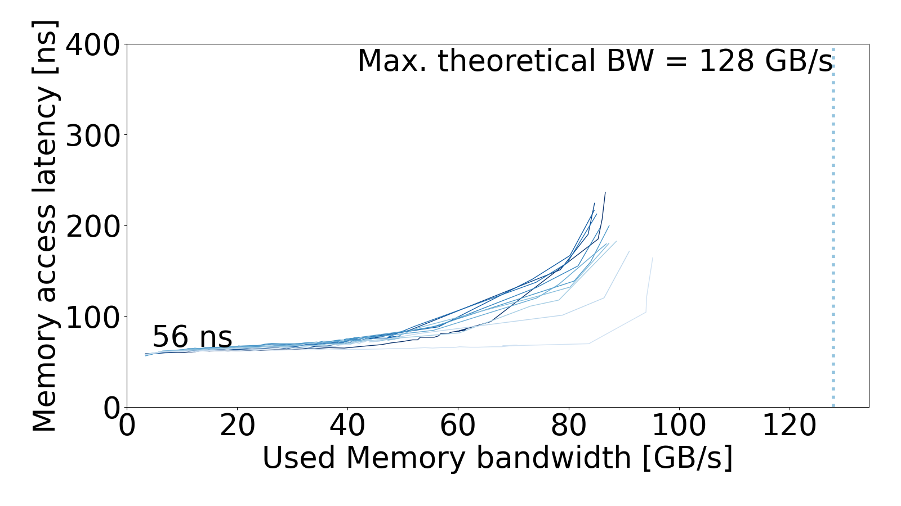 | 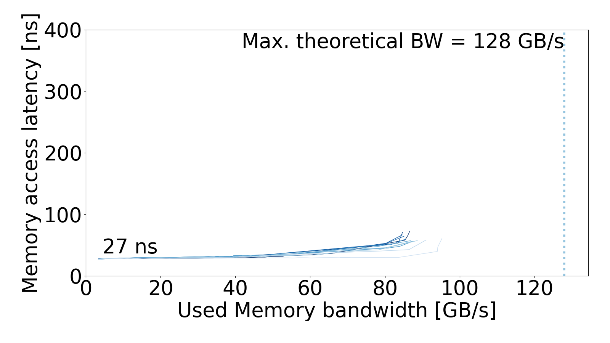 |

### `03-correct-freq`

Paper figure: Figure 4

| Memory simulator view | Memory interface view | Application view |
|:---:|:---:|:---:|
| 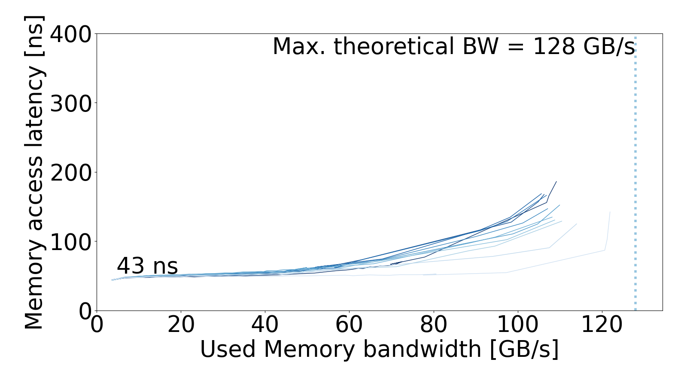 |  | 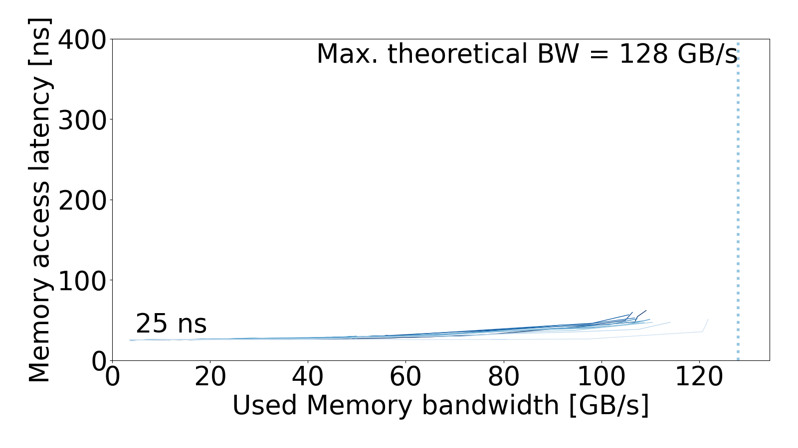 |

### `04-memory-model`

Paper figure: Figure 8  

| Memory simulator view | Memory interface view | Application view |
|:---:|:---:|:---:|
| 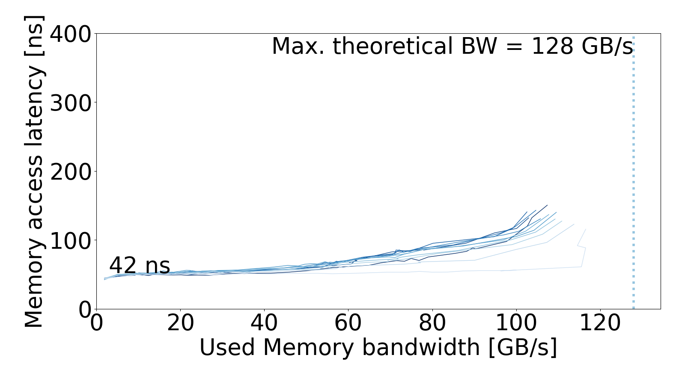 | 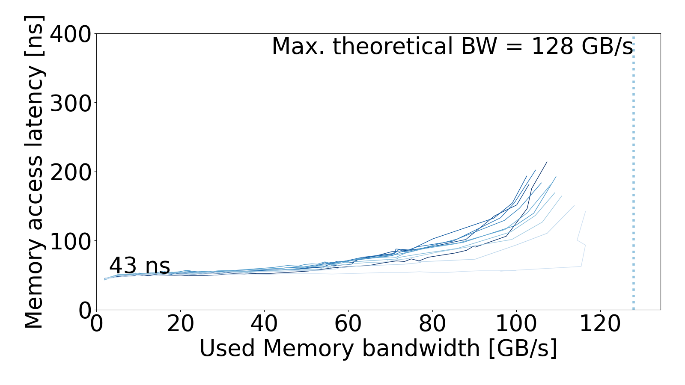 | 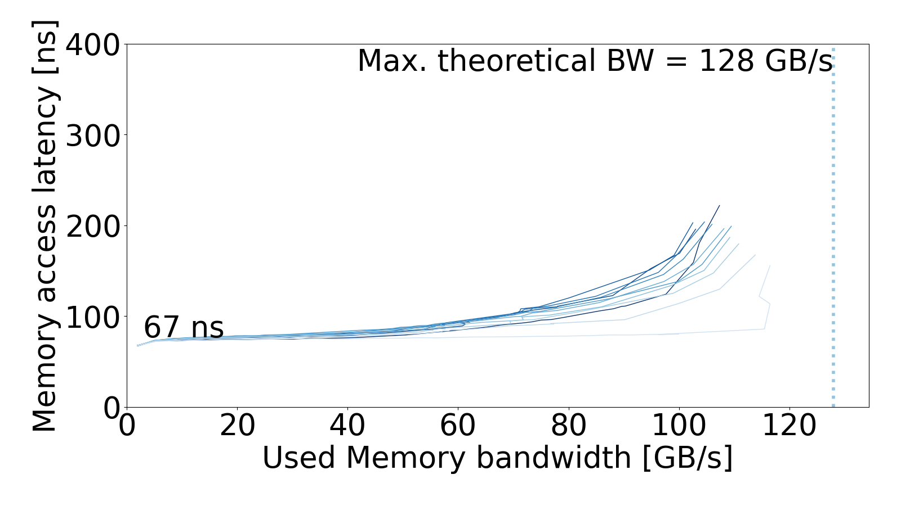 |

### `05-address-mapping`

Paper figure: Figure 9a

| Memory simulator view | Memory interface view | Application view |
|:---:|:---:|:---:|
|  |  |  |

### `06-noc`

Paper figure: Figure 9b

| Memory simulator view | Memory interface view | Application view |
|:---:|:---:|:---:|
|  |  |  |

### `07-prefetcher`

Paper figure: Figure 9c

| Memory simulator view | Memory interface view | Application view |
|:---:|:---:|:---:|
| 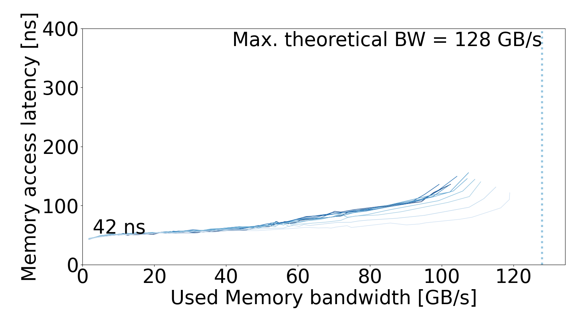 | 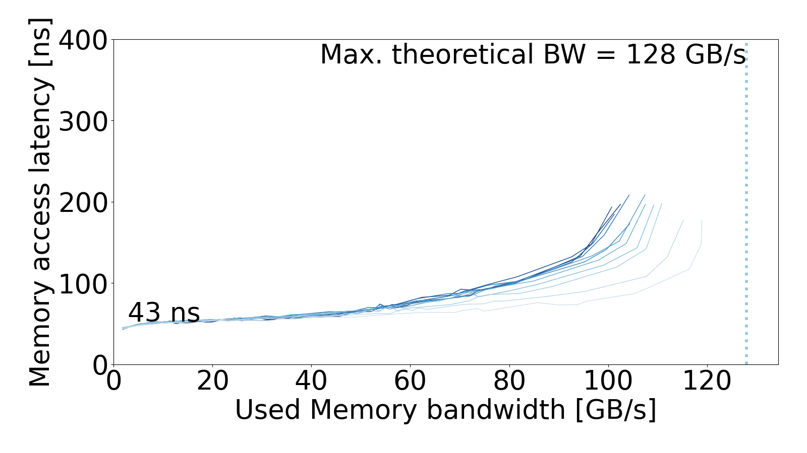 | 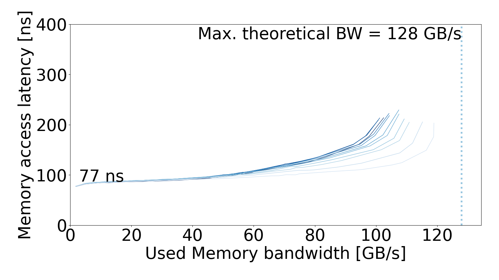 |

### `08-portability-ramulator2`

Paper figure: Figure 11b
Committed views: memory interface and application

| Memory interface view | Application view |
|:---:|:---:|
|  |  |

### `09-portability-dramsim3`

Paper figure: Figure 11c
Committed views: memory interface and application

| Memory interface view | Application view |
|:---:|:---:|
|  |  |

### `10-portability-dramsys`

Paper figure: Figure 11d
Committed views: memory interface and application

| Memory interface view | Application view |
|:---:|:---:|
|  |  |

### `11-mem-intensive`

Paper figures: Figure 10 and Figure 11e

The raw measurements are generated locally. This experiment requires five
benchmark points for each of ten unique stages—50 simulation points total—so a
separate raw-data archive is unnecessary.

- Processed data: [`11-mem-intensive/processed/mem_intensive.csv`](11-mem-intensive/processed/mem_intensive.csv)
- Figure 10: [`11-mem-intensive/figures/mem_intensive.pdf`](11-mem-intensive/figures/mem_intensive.pdf)
- Figure 11e: [`11-mem-intensive/figures/mem_intensive_portability.pdf`](11-mem-intensive/figures/mem_intensive_portability.pdf)
